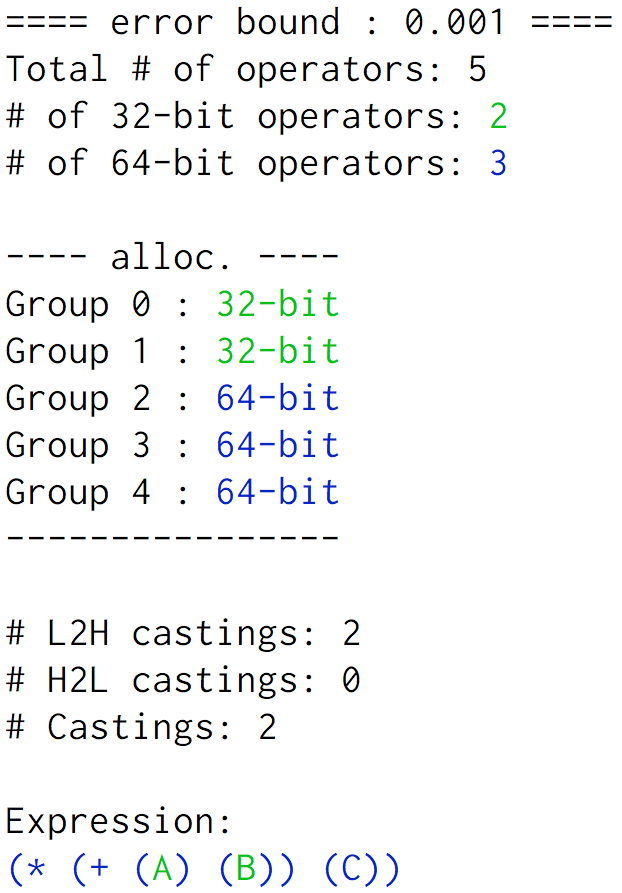

<meta name="robots" content="noindex" />
<div style="float: right">

<br>

</div>

# Table of Contents
- [Overview](#overview)
- [Requirements](#requirements)
- [Installation](#installation)
- [Running FPTuner](#running) 
- [To POPL Artifact Evaluation Reviewers](#to-popl-ae)
    - [Reproduce the tuning results of Table 5.1 and Table 5.2](#to-popl-ae-tables)
    - [Performance and energy measurements](#to-popl-ae-perf-energy) 
    - [Tuning results and tuning performance may be affected by global optimization](#to-popl-ae-global-opt)
    - [Individually running the Benchmarks](#to-popl-ae-run-others)
    - [Reference](#to-popl-ae-reference)     
- [Example of Expression Specification](#expr-specification) 
- [Acknowledgements](#acknowledgements)

# <a name="overview"></a>Overview

FPTuner is a rigorous tool for automatic precision-tuning of real
valued expressions. FPTuner generates a mixed-precision allocation
(single, double, or quadruple precision) on a given input domain that
is guaranteed to have error below a given threshold.

In addition to precision-tuning, FPTuner also allows users to control
precision allocation in ways that helps optimize code. As two examples,

- it allows users to control the maximum number of type-casts
introduced during precision allocation. Capping the number of type-casts
can help reduce the associated overheads.

- FPTuner allows users to group ("gang") expressions (typically similar
expression) and force the principal operators of these expressions to
share the same precision allocation. Doing so encourages
the compiler to do vectorization.


For further details of FPTuner, please consult our paper. The rest
of this file will guide you through FPTuner's installations.
A more comprehensive reference manual of FPTuner is 
situated at <a href="https://github.com/soarlab/FPTuner/blob/master/Reference.md">Reference.md</a>.
This reference manual describes FPTuner's flags in detail.
The flags include basic flags (error threshold allowed, precision choices available)
and allocation-controlling flags (fix the number of type-casts, gang expressions, etc.)


# <a name="requirements"></a>Requirements

FPTuner has been tested on Ubuntu 12.04, 14.04, 16.04 on x86_64;
we recommend version 16.04.
It depends on the following free projects:
- git 
- python3 (FPTuner currently supports python3 only)
- PLY for python3
- bison
- flex
- ocaml
- g++

On Ubuntu these can all be installed with
```
sudo apt-get install -y git python3-ply bison flex ocaml g++ make
```

Apart from these, FPTuner also depends on Gurobi v6.5. Note that FPTuner's
installation script **does not** automatically install Gurobi. Please follow
the following steps to install Gurobi and obtain a free academic license.

1. Installation. 
  - On [Gurobi website](http://www.gurobi.com) (tab "DOWNLOADS") select "Download Center." 
  - Select "Gurobi Optimizer." You need to register for an account to obtain the academic licenses. 
  - Download `gurobi6.5.2_linux64.tar.gz` and unpack with `tar -xvf gurobi6.5.2_linux64.tar.gz`.
  - Execute `cd gurobi652/linux64` and `./setup.py build`.

2. Set the required environment variables as follows: 
    ```
    export GUROBI_HOME=your-path/gurobi652/linux64
    export PATH=$GUROBI_HOME/bin:$PATH
    export LD_LIBRARY_PATH=$GUROBI_HOME/lib:$LD_LIBRARY_PATH
    ```

3. Obtain an academic license. 
  - Go to [https://user.gurobi.com/download/licenses/free-academic](https://user.gurobi.com/download/licenses/free-academic).
  - Read the User License Agreement and the conditions, then click "Request License."  
  - Copy command `grbgetkey your-activation-code` shown on the screen.
  - Under the `bin` directory of your Gurobi installation, run the `grbgetkey`
    command which you just copied. This command will require you to enter a
    path to store the license key file. The `grbgetkey` command will indicate you
    to setup environment variable `GRB_LICENSE_FILE` to the license file path.

4. After the installation, add the path of Gurobi's python module to environment variable `PYTHONPATH`.
  - Assuming Gurobi is installed under `GUROBI_HOME`, you should have a
    directory similar to `$GUROBI_HOME/lib/python3.4_utf32`. **Note**: We
    assumed the version of Gurobi to be 6.5.2, and hence your Gurobi path
    may be different. Also, type `python3 --version` to find the Python
    version on your system. If it is Python 3.5, use
    `$GUROBI_HOME/lib/python3.5_utf32` instead.
  - Add this to your environment with
    `export PYTHONPATH=$GUROBI_HOME/lib/python3.4_utf32:$PYTHONPATH`

For more installation details, please refer to the [user
menu](http://www.gurobi.com/documentation/6.5/quickstart_linux.pdf). 


# <a name="installation"></a>Installation 

1. Download FPTuner from our GitHub repository: `git clone https://github.com/soarlab/FPTuner`

2. Go to the root directory of FPTuner, for example: `cd ./FPTuner`

3. Run the setup script **at the root directory of FPTuner**: `python3 setup.py install`

4. Set up the required environment variables. 
The installation script will create a file `fptuner_vars` for setting the related
environment variables. To do so, run `source fptuner_vars`.

[//]: # (The following seems redundant now.)
[//]: # (Please follow the instructions for the setup.)

To uninstall, run `python3 setup.py uninstall`.


# <a name="running"></a>Running FPTuner

To test the installation, please try out the hello-world example through the
following steps: 

1. Go to directory `bin` under the root of FPTuner. 

2. Run command `python3 ./fptuner.py -e 0.001 ../examples/helloworld0.py`

The console output of FPTuner should be the following: 
```
==== error bound : 0.001 ====
Total # of operators: 5
# of 32-bit operators: 2
# of 64-bit operators: 3

---- alloc. ----
Group 0 : 32-bit
Group 1 : 32-bit
Group 2 : 64-bit
Group 3 : 64-bit
Group 4 : 64-bit
----------------

# L2H castings: 2
# H2L castings: 0
# Castings: 2

Expression:
(* (+ (A) (B)) (C))
```
In addition, a .cpp file `helloworld0.0.001.cpp` will be generated. 
Now we describe how to use FPTuner with this hello-world example. 


## Input 
FPTuner takes an expression specification and an user-specified error threshold for generating the optimal allocation. 
In the command ```python3 ./fptuner.py -e 0.001 ../examples/helloworld0.py```, file **helloworld0.py** is the expression specification and **-e 0.001** specifies 1e-03 as the error threshold. 

The later section "**Example of Expression Specification**" describes how to specify the expression through the python-based interface. 


## Output
FPTuner summarizes the number of 32- and 64-bit operators, prints the allocation on the console. 
In the example output, for example, `Group 0 : 32-bit`
denotes that the group 0 (gang 0) operators are assigned 32-bit precision. 
**# L2H castings** (resp., **# H2L castings**) indicates the number of low-to-high (resp., high-to-low) type casts in this allocation. 
**# Castings** is the summation of **# L2H castings** and **# H2L castings**. 
In addition to the console output, a .cpp file is synthesized by FPTuner which implements the allocation.

When outputting to a terminal a colorized s-expression will be emitted indicating the allocations of variables and operations. For example:



Variables *A* and *B* are allocated at 32-bit precision as indicated by the green text. Blue text indicates that each operation and variable *C* are allocated at 64-bit precision. Notably, the blue parenteses around *A* and *B* mean that they are both cast to 64-bit.


# <a name="to-popl-ae"></a>To POPL Artifact Evaluation Reviewers
## <a name="to-popl-ae-tables"></a>Reproduce the tuning results of Table 5.1 and Table 5.2
The tuning results of Table 5.1 are shown under column "# of double-ops forced by Es" and the results of Table 5.2 are shown under column "# of single-ops forced by Es." 
With a correct installation of FPTuner (e.g., the above hello-world example works), the fastest way to reproduce the two tables is using the scripts under directory **bin**. 

For Table 5.1, please run (under directory **bin**) 
```
./test-table-5.1
```

For Table 5.2, please run (under directory **bin**)
```
./test-table-5.2
```


## <a name="to-popl-ae-perf-energy"></a>Performance and energy measurements
We currently don't offer the scripts to automatically measure performance and energy. 
However, as demonstrated through the hello-world example, the .cpp files of the corresponding mixed precision allocations are offered. 
You can freely do performance and energy measurements with those .cpp files on your platforms. 


## <a name="to-popl-ae-global-opt"></a>Tuning results and tuning performance may be affected by global optimization
The tuning results and the tuning performance of FPTuner are affected by the underlying global optimization. 
The global optimization may calculate tight bounds (resp., loose bounds) of the first derivatives that result in more (resp., fewer) low-precision operators. 
In addition, FPTuner's performance is currently dominated by global optimization. 
Consequently, there may be tuning results which don't exactly match results shown in the paper. 


## <a name="to-popl-ae-run-others"></a>Individually running the Benchmarks 
Similar to the hello-world example, we can run each of the benchmarks with the following command (under directory **bin**): 
```
python3 ./fptuner.py -e "0.001 0.0001" -b "32 64" path-to-the-benchmark
```
(The desired error thresholds and the bit-width candidates are specified with options -e and -b respectively.) 
The following table offers the benchmark names and their relative paths to the root directory of FPTuner. 

| **Benchmark Name** | **Relative Path to the Root of FPTuner** |
|--------|--------|
| sine         | examples/primitives/sine.py | 
| sqroot       | examples/primitives/sqroot.py | 
| sineOrder3   | examples/primitives/sineOrder3.py | 
| predatorPrey | examples/primitives/predatorPrey.py |
| verhulst     | examples/primitives/verhulst.py |
| rigidBody 1  | examples/primitives/rigidBody-1.py |
| rigidBody 2  | examples/primitives/rigidBody-2.py |
| turbine 1    | examples/primitives/turbine-1.py |
| turbine 2    | examples/primitives/turbine-2.py |
| turbine 3    | examples/primitives/turbine-3.py |
| doppler 1    | examples/primitives/doppler-1.py |
| doppler 2    | examples/primitives/doppler-2.py |
| doppler 3    | examples/primitives/doppler-3.py |
| carbonGas    | examples/primitives/carbonGas.py |
| jet          | examples/primitives/jet.py |
| cone-area    | examples/math/cone-area.py |
| Gaussian     | examples/math/gaussian.py |
| Maxwell-Boltzmann | examples/math/maxwell-boltzmann.py |
| reduction    | examples/micro/reduction.py |


## <a name="to-popl-ae-reference"></a>Reference
The complete reference of FPTuner is given in <a href="https://github.com/soarlab/FPTuner/blob/master/Reference.md">Reference.md</a>. 

Here we introduce some more tuning options provided by FPTuner.
 
### Candidate bit-widths
FPTuner tunes for mixed 32- and 64-bit by default. 
Tuning for mixed 64- and 128-bit can be done with option 
```
-b "64 128"
```
FPTuner currently supports tuning for the following three bit-width candidate sets: 
- 32- and 64-bit (specified with ```-b "32 64"```)
- 64- and 128-bit (specified with ```-b "64 128"```)
- 32-, 64-, and 128-bit (specified with ```-b "32 64 128"```) 

### Multiple error thresholds
FPTuner can take multiple error thresholds and generate the optimal allocation of each threshold. 
For example, the following option results in two allocations generated for the two error thresholds (0.001 and 0.0001): 
```
-e "0.001 0.0001"
```


# <a name="expr-specification"></a>Example of Expression Specification
FPTuner decides the optimal bit-widths of the operators in the floating-point implementations of real-number computations.

At this point, FPTuner provides a Python interface that allows the users to specify their the real-number computations. 
In this section, we introduce how to use the Python interface through a simple example: 
```
(A + B) * C
```
which is the *hello-world 0* example. 


## Invoke the interface module 
- In a python (.py) file, use the following line to invoke the interface module: 
    ```
    import tft_ir_api as IR
    ```

- Note that the **src** directory under the FPTuner root directory should be added to the environment variable **PYTHONPATH**. 


## Declare bounded variables
FPTuner currently supports variables which have bounded and contiguous ranges. 
For example, we want to declare three variables, A, B, and C, and assign [0.0, 100.0] as their ranges. 
This can be achieved with function **IR.RealVE** as shown in the following lines: 
```
A = IR.RealVE("A", 0, 0.0, 100.0) 
B = IR.RealVE("B", 1, 0.0, 100.0) 
C = IR.RealVE("C", 2, 0.0, 100.0) 
```
Function **IR.RealVE** returns a variable (variable expression) with taking four arguments: 

1. The label of the variable. 

2. The group ID of the variable. 
Expressions assigned with the same group (gang) ID will be assigned with the same bit-width. 
In this example, we assume that we want to assign different bit-widths to the variables. 
Thus, the three variables have different ID: A has 1, B has 2, and C has 3.

3. The lower bound of the value range. 

4. The upper bound of the value range. 


## Specify binary expressions 
There are two binary expressions in our example, and they can be specified with function **IR.BE** as shown in the following line: 
```
rel = IR.BE("*", 4, IR.BE("+", 3, A, B), C) 
```

The application 
```
IR.BE("+", 3, A, B)
``` 
results in a binary expression ```(A + B)```. 
The four arguments are explained as follows: 

1. The first argument is a string which specifies the binary operator. 
In this case, "+" specifies the addition. 

2. The second argument is an integer which gives the group ID. 
Expressions having the same group ID will be assigned with the same bit-width. 

3. The third argument is the left-hand-side operand. 
In this case, it is variable A. 

4. The fourth argument is the right-hand-side operand. 
In this case, it is variable B. 

Similarly, 
``` 
IR.BE("*", 4, IR.BE("+", 3, A, B), C) 
```
returns expression 
```
(A + B) * C
```


## Tune for expression (A + B) * C
To assign ```(A + B) * C``` to FPTuner as the tuning target, we use the following line: 
```
IR.TuneExpr(rel)
``` 

**rel** is the reference of our targeted expression. 
Function **IR.TuneExpr** specifies the expression to tune. 


# <a name="acknowledgements"></a>Acknowledgements 
Supported in part by NSF grants 1643056, 1421726, and 1642958. 
